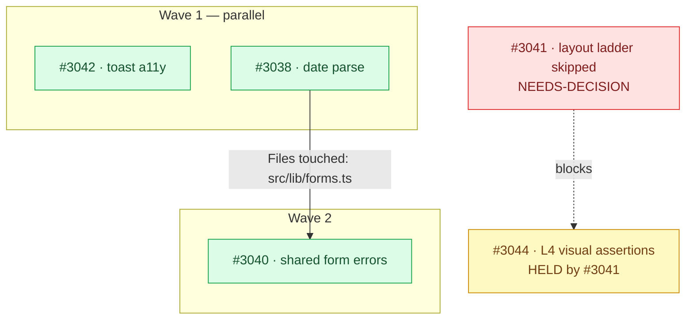

---dossier
{
  "dossier_schema_version": "1.0.0",
  "name": "sheet-triage",
  "title": "QA Sheet Triage",
  "version": "1.3.0",
  "protocol_version": "1.0",
  "status": "Draft",
  "last_updated": "2026-08-04",
  "objective": "Turn a manual-QA findings spreadsheet into verified, clustered GitHub issues plus the detection-gap fixes that would have caught each bug automatically, then grade each issue for autonomous readiness and emit a dependency-ordered execution plan for the ready ones",
  "description": "Ingest a manual-QA findings sheet, validate that every referenced piece of evidence is actually readable, surface-review the findings for discrepancies, cluster them by the code surface a fix would touch, investigate each cluster with parallel root-cause / generalization / detection-gap agents, file one issue per cluster, independently review each filed issue for full-cycle readiness, emit a dependency-ordered execution plan for the ready set, and write the triage result back as a companion sheet. Use when the user says 'triage QA sheet', 'QA findings', 'manual QA results', or hands over a spreadsheet of bugs.",
  "category": [
    "testing",
    "maintenance"
  ],
  "tags": [
    "qa",
    "triage",
    "github",
    "workflow",
    "testing",
    "root-cause"
  ],
  "risk_level": "medium",
  "requires_approval": false,
  "risk_factors": [
    "network_access",
    "requires_credentials"
  ],
  "destructive_operations": [
    "Creates GitHub issues in the target repository (team-visible, noisy to undo)",
    "Applies readiness labels to the issues it files, and creates those labels in the repository if absent",
    "Edits the bodies of issues it filed in this run to record dependency edges",
    "Creates a new companion spreadsheet in the QA evidence folder",
    "Appends to the persistent triage cycle log outside the working tree"
  ],
  "estimated_duration": {
    "min_minutes": 20,
    "max_minutes": 120
  },
  "tools_required": [
    {
      "name": "gh",
      "description": "GitHub CLI, authenticated against the target repository",
      "check_command": "gh auth status"
    }
  ],
  "inputs": {
    "required": [
      {
        "name": "sheet",
        "description": "The QA findings source: a spreadsheet URL or ID reachable through the agent's document connector, a local .csv/.tsv path, or pasted tabular text",
        "type": "string",
        "example": "https://docs.google.com/spreadsheets/d/1Gz8.../edit"
      }
    ],
    "optional": [
      {
        "name": "repo",
        "description": "Target GitHub repository in owner/name form. Defaults to the current repository's origin remote.",
        "type": "string",
        "default": "auto"
      },
      {
        "name": "dry_run",
        "description": "Run every investigation phase and print the full report, but create no issues and no companion sheet",
        "type": "boolean",
        "default": false
      },
      {
        "name": "only",
        "description": "Comma-separated finding IDs to process, ignoring the rest of the sheet",
        "type": "string",
        "default": ""
      },
      {
        "name": "no_writeback",
        "description": "Skip Phase 7 — file issues but create no companion sheet",
        "type": "boolean",
        "default": false
      },
      {
        "name": "checkpoint",
        "description": "Always stop for review after the Phase 1 surface review, even when nothing is ambiguous",
        "type": "boolean",
        "default": false
      },
      {
        "name": "ready_label",
        "description": "Label applied in Phase 5 to issues judged ready for autonomous full-cycle execution. Created in the repository if it does not exist. The not-ready label is deliberately not configurable: it is `needs-clarification`, which `imboard-ai/git/gate-issue` already treats as a hard block.",
        "type": "string",
        "default": "ready:full-cycle"
      }
    ]
  },
  "outputs": {
    "files": [
      {
        "path": "~/.dossier/logs/qa-sheet-triage/{project}/TRIAGE-CYCLE-LOG.md",
        "description": "Cumulative append-only cycle ledger, one section per round, kept per-project outside the working tree. Read back every round to audit prior rounds' promised artifacts. Never gzipped, never pruned.",
        "format": "markdown"
      }
    ]
  },
  "authors": [
    {
      "name": "Yuval Dimnik"
    }
  ],
  "checksum": {
    "algorithm": "sha256",
    "hash": "245a1db0e1a76e07e204d859a6cb572bdb2590cd20ae20e0710416ad1b077ec4"
  },
  "signature": {
    "algorithm": "ed25519",
    "signature": "3TVPTiu4lqFxls8zIqXzHsq/qSfbm/V0C8BVg0MQJjiDsIB74t1VeJ2wURTFEgdJky5g+eZJRGUtZ0zDKpkBBA==",
    "public_key": "-----BEGIN PUBLIC KEY-----\nMCowBQYDK2VwAyEAT5MH6NyHt3zBur6eq+EVSNOA2AZbuSRpov+/BRFzLnY=\n-----END PUBLIC KEY-----\n",
    "signed_at": "2026-08-04T05:55:56.337Z",
    "key_id": "imboard-ai",
    "signed_by": "Yuval Dimnik <yuval.dimnik@gmail.com>"
  }
}
---

# QA Sheet Triage

## Objective

A human tester hands over a sheet of findings. **The findings are not the deliverable —
the misses are.**

Every finding on that sheet is a defect that reached a human because no automated check
caught it first. Fixing the bug closes one instance. Naming and closing the gap that let
it through retires the class. Produce both, but understand which one you are actually
here for.

This matters most where the product has few or no users: automated checking is the *only*
thing standing between a defect and production, so a human finding a bug is already a
system failure, independent of how bad the bug is. Treat a four-month-old 100%-failing
workflow and a cosmetic typo as the same category of question — *why did nothing catch
this?*

Measure a round by **classes of defect retired**, not by bugs found.

A round ends in a **dispatchable plan**, not a pile of issues. Issues that a fresh agent
cannot act on without asking a question are half-finished work wearing a tracker number;
they are separated out and labelled as such rather than left for someone to discover at
dispatch time. What survives that grading is ordered into waves and handed to
`imboard-ai/git/fleet-cycle` ready to run.

## Guiding Principle

**Measured, not reasoned.** Every claim you make about the code is either CONFIRMED —
you read the file, ran the command, saw the output — or SUSPECTED. Label each one. A
tester's description is a report of symptoms, never a diagnosis.

**A proposed artifact is not a closed gap.** An issue that says "we should add a test" has
retired nothing. The gap closes when the artifact exists and runs — verify that, and carry
anything unverified into the next round rather than counting it as done.

**Ready means buildable from the issue alone.** The agent that eventually implements one of
these issues will read the issue, not this conversation. Everything the triage run learned
that is not written into the issue body is lost. Grade readiness on the published text, by
an agent that did not write it.

**Do not stop to ask mechanical questions.** Issue titles, cluster names, label choices,
file paths and ordering are yours to decide. Pause only where this dossier says to.

**Stop at filed issues.** This workflow does not change product code, and does not dispatch
the execution plan it produces. Fixing is a separate, deliberately-triggered workflow.

**Nothing this workflow writes lands in the repository working tree.** The cycle log lives
outside it (Phase 8). A QA process artifact committed to the product repo is noise in every
future diff and blame.

## Prerequisites

- GitHub CLI (`gh`) installed and authenticated against the target repository.
- Read access to the findings sheet and to every file it references.
- You are inside the target repository's working tree.

## Actions to Perform

### Phase 0: Access & Integrity Gate

Prove you can actually read everything before you reason about any of it. A silent
partial read is the failure mode this phase exists to prevent.

1. Resolve the sheet from the `sheet` input. If none was given, search the document
   store by likely title and report candidates rather than guessing.
2. Fetch its metadata: confirm it is a spreadsheet, and record owner, parent folder and
   last-modified time.
3. Read the full grid, including any legend, instructions or "how to use" tab. Those
   tabs usually carry the evidence-folder link and the severity/status vocabularies.
4. **Resolve every referenced artifact.** Screenshots, recordings and linked documents
   are the evidence for the findings. For each: fetch metadata, and read the content of
   every image (or a representative sample when there are more than 15). You are
   checking two different things — that the artifact is *readable*, and that it *shows
   what the row claims it shows*.
5. List the evidence folder itself and compare its contents against the links in the
   sheet. Per-file sharing frequently means the folder listing is incomplete; say so
   rather than assuming the missing files do not exist.
6. Search for duplicate copies of the sheet. Testers often work in their own copy while
   the recipient holds a separate one. State plainly which copy you read and which
   folder any write-back will target.

**Hard block**: if the sheet itself cannot be read, stop and report. Do not proceed on a
partial read.

Otherwise emit a per-artifact status table — readable / empty / unreadable / missing —
and carry it forward. Unreadable evidence is a finding about the QA process and belongs
in the final report.

### Phase 1: Surface Review

A fast pass over the findings as *written*. No code reading yet.

Normalize the rows into a table, then flag:

- Repro steps that are incomplete, or that do not actually reach the described state.
- Missing evidence, or evidence that contradicts the written claim.
- Severity or priority that disagrees with the described impact.
- **Rows that are not defects** — feature requests, product questions, and copy
  preferences filed as bugs. These are still valuable; they are just not bug issues.
- Duplicates within the sheet.
- **Candidate clusters** — rows sharing a symptom, an error string, or a screen.
- **Already filed or already fixed** — search the issue tracker (open *and* closed) for
  each finding's distinguishing phrase before assuming it is new.

Output the review table plus an explicit **"Needs a decision"** list.

**Pause rule.** Continue automatically for everything unambiguous. Stop and ask only
when the sheet or its evidence is unreadable, a finding is a genuine product decision,
or a finding looks like a duplicate of existing tracker work. When `checkpoint` is set,
always stop here. Every other flag travels forward into the issue body as an
`## Open questions` section — flagging is not the same as blocking.

### Phase 2: Cluster by Code Surface

Group findings by **the code a fix would touch**, not by how they look to a user.

- Same file or module, same fix → **one** issue covering several finding IDs.
- Different surfaces → **separate** issues, cross-referenced.
- Every cluster must be justified with the **shared file path(s)** that make it a
  cluster. A cluster you cannot justify with a path is a guess — split it.
- Default to separate issues when unsure. Over-merging hides work; over-splitting only
  costs a little noise.

Two findings with identical symptoms in different components are usually two issues that
share one detection gap. Two findings with different symptoms emitted from the same
function are usually one issue.

### Phase 3: Investigate — Three Lenses, Each At Its Own Scope

Three lenses, run in parallel. **Each lens has a different natural scope, and getting this
wrong is the most expensive mistake available here:**

| Lens | Scope | Why |
|---|---|---|
| **A — Root cause** | one per cluster | Diagnosis is inherently local to the code a fix touches. |
| **B — Generalization** | one per *pattern* | A pattern spans clusters. Two clusters sharing a defect shape need one search, not two. |
| **C — Detection gap** | **exactly one, over ALL findings** | This is the primary lens, not the third one. Its most valuable output is the gap explaining several findings at once — sharded per cluster it is structurally incapable of seeing that. |

Lens C is the reason the round exists. If effort has to be cut, cut A and B coverage
before cutting C's depth.

Do **not** run a detection-gap agent per cluster. It will report the same shallow
"add a test here" N times and will miss the repeated gap — which is the single
highest-value thing this workflow can produce. One agent, all findings, once.

Identify the patterns for lens B *after* clustering: look for clusters whose root causes
rhyme (same missing guard, same primitive, same contract violation). One B agent per
distinct pattern. If no clusters rhyme, one B agent per cluster is the degenerate case.

**Proportionality.** Match investigation depth to what is at stake. Before launching,
decide and state which mode you are in:
- **Full** — anything user-blocking, data-touching, security-adjacent, or affecting a
  primary flow. All three lenses.
- **Light** — cosmetic, copy, and single-call-site presentation findings. Lens A only,
  plus a single shared lens C for the whole batch. Do not spawn a generalization agent to
  ask whether a typo generalizes.

A round of eleven CSS nits does not deserve the same fleet as a round containing a 500 on
a primary action. Say which mode you chose and why.

---

#### Classification Criteria (applies to ALL investigation agents)

Label every claim:

- **CONFIRMED** — you read the specific file, ran the specific command, and observed the
  result. Cite `file:line` or the command output.
- **SUSPECTED** — consistent with the evidence but not verified. Say what would confirm it.

Never present a SUSPECTED claim in CONFIRMED language. An unlabelled claim is a defect in
your output.

---

#### Agent A: Root Cause

> You are diagnosing a confirmed QA finding. You will be given the finding text, the
> tester's repro steps, and the observed symptom including any verbatim error strings.
>
> Establish what is actually broken:
> 1. Follow the repro path through the code from the entry point the tester used.
> 2. Locate the exact origin of the observed behaviour — for an error string, find where
>    that string is produced, not merely where it is displayed.
> 3. State the **proximate** cause (what fails) separately from the **design** cause
>    (why the code was shaped so this could happen). They are rarely the same, and the
>    second is the one worth fixing.
> 4. Describe the minimal correct fix. Do not implement it.
>
> Cite `file:line` for every structural claim, and classify per the Classification
> Criteria above. If the finding does not reproduce in the code as described, say so
> explicitly — a finding that cannot be traced is a result, not a failure.

#### Agent B: Generalization

> You are checking whether a confirmed defect is an instance of a pattern.
>
> Given the root-cause location, search the **whole** codebase for other sites with the
> same shape — the same missing guard, the same unsafe assumption, the same
> copy-pasted construct. Search by structure, not by the specific identifiers involved;
> the same bug rarely reuses the same variable names.
>
> Report every match as `file:line` with a one-line note on whether it is genuinely the
> same defect or merely similar-looking. Then recommend exactly one of:
> - **Fix centrally now** — a single change resolves all sites,
> - **Fix here, sweep separately** — with the sweep scoped and sized,
> - **Not generalizable** — this is genuinely a one-off, and say why.
>
> Where a lint rule, type constraint, or static guard could make the whole class
> unrepresentable, propose it concretely enough to implement.
>
> Classify per the Classification Criteria above. If nothing else matches, report
> "No other instances found" — that is a real and useful result.

#### Agent C: Detection Gap

> You are answering the question a good bug-fix review asks: **what automated check
> should have caught this before a human did, and why did it not?**
>
> First, learn how this project actually tests itself. Read its contributor guide, its
> QA and testing documentation, its pull-request template, and its CI workflow
> definitions. Understand the layers that already exist before proposing anything — your
> job is to fill a hole in *their* ladder, not to install a new one.
>
> Then determine:
> 1. Which existing layer *should* own this class of defect.
> 2. Why it did not catch this instance. Distinguish sharply between: **no test existed**,
>    **a test existed but did not run** (gating, discovery, or scoping excluded it), and
>    **a test ran but asserted too loosely**. These have completely different fixes.
> 3. The specific artifact that closes the gap.
>
> Your output must terminate in a **named, addable artifact** — a concrete test file
> path, a fixture or scenario registration, a coverage-baseline entry, a lint rule, or a
> CI configuration change. "Add more integration tests" is not an answer. Neither is
> "an end-to-end test would catch it", which is nearly always true and nearly always the
> most expensive way to be right — reach for the cheapest layer that could have caught it.
>
> Note especially any defect that is structurally invisible to the existing layers —
> for example behaviour that only exists while an overlay is open, an element is
> hovered, or data is present. Those gaps recur, and naming the structural reason is
> worth more than naming the single missing test.
>
> Because you see every finding at once, your most valuable output is any gap that
> explains **more than one** of them. Look for it deliberately. Also check whether the
> layer you are about to recommend actually *runs* — a suite that is never invoked, or
> that passes vacuously when its inputs are missing, is a gap and not a safeguard.
>
> Classify per the Classification Criteria above.

---

#### Reporting

Every agent must **send its findings back**. An agent that finishes without reporting has
done no work. If an agent goes idle without delivering, ask it again and require a
partial answer with the unreached parts named — partial findings, clearly labelled, are
useful; silence is not.

---

#### Reconcile Before Believing

Agents disagree, and when they do **they are often both wrong**. Before any finding
reaches an issue:

1. **Diff the overlapping claims.** Where two agents counted, named, or located the same
   thing differently, treat *both* numbers as unverified.
2. **Measure it yourself.** Run the grep, open the file, count the call sites. Do not
   average the estimates, do not pick the more confident agent, and do not quote a
   number in an issue that no one measured.
3. **Prefer the specific over the plausible.** A claim citing `file:line` outranks a
   claim citing a rationale, regardless of which agent sounds more certain.
4. **Carry disagreements forward when they cannot be resolved.** An issue that says "two
   analyses disagreed on scope; verify before sweeping" is honest and useful. An issue
   that silently picks one is a fabrication with a citation.

A number that lands in a GitHub issue is a number someone will act on. Earn it.

#### After All Agents Complete

Collect the three outputs per cluster. Where Agent A could not trace a finding, mark the
cluster as unconfirmed and carry it to the report rather than filing a speculative issue.

Where several clusters share one detection gap, note it — a gap that appears more than
once in a single QA round is the highest-value thing this workflow can find, and it
should be filed once, not repeated in every issue.

### Phase 4: File Issues

Learn the repository's issue conventions before writing anything: read its contributor
guide for which template applies to bug reports, look at two or three recent, well-formed
bug issues to calibrate title and body style, and list the available labels rather than
inventing them.

**One issue per cluster.** Structure the body so a reader gets, in order: what is broken
and how it was found, where it lives, why it happens, what to change, what else is
affected, and how it should have been caught. Concretely:

- **Provenance first** — that this came from manual QA, by whom, when, and a link to the
  sheet. Readers must be able to trace a claim back to its evidence.
- **The tester's evidence verbatim** — exact error strings in backticks, screenshot
  links, the finding IDs it covers. Do not paraphrase an error message.
- **`file:line` for everything structural**, from Agent A.
- **Files touched** — a plain list of the cluster's justifying paths from Phase 2, on its
  own line as `Files touched: path/a.ts, path/b.tsx`. This is the same set that justified
  the cluster, so it costs nothing to emit, and Phase 6 reads it to compute file-overlap
  edges. Without it the execution plan has to re-derive by guesswork what Phase 2 already
  established.
- **Root cause**, with CONFIRMED / SUSPECTED preserved. Do not launder a hypothesis into
  a fact on the way into the issue.
- **Also affected**, from Agent B — omit the section entirely when nothing matched.
- **Detection gap**, from Agent C — what would have caught it, and why it did not.
- **Open questions**, carrying any unresolved Phase 1 flags — omit when empty.
- **Explicitly out of scope**, so the fix does not sprawl.
- **Acceptance criteria** as checkboxes, including the named detection-gap artifact and
  whatever hygiene/lint gate the project requires before merge.

**Spin off a separate issue** only when Agent B's generalization is substantially larger
than the bug fix, or Agent C's prevention work is its own infrastructure change. Label
those as testing or infrastructure work and cross-reference the bug issue. Do not bury
a codebase-wide sweep inside a single-screen bug fix.

Before creating anything, search the tracker once more for each cluster's key phrase and
skip anything already filed. Then create the issues, and record the resulting numbers
and URLs against their finding IDs.

Never apply labels that belong to pull requests rather than issues — merge-automation,
hold, and CI-trigger labels in particular.

### Phase 5: Readiness Review

Every issue filed in Phase 4 is now graded for **autonomous execution readiness** — can
`imboard-ai/git/full-cycle-issue` take this issue to a merged PR without a human unblocking
it partway through?

**Run one reviewer agent per filed issue, in parallel. The reviewer must not be the agent
that wrote the issue.** Self-assessment here is worthless: the author already believes the
issue is clear, and is the one person who cannot notice what they left in their head. This
is the same discipline as *Reconcile Before Believing* — an independent read, not a
second opinion from the same context.

**The reviewer reads the published issue and nothing else.** No triage transcript, no
agent output, no sheet. That is exactly the input the implementer will have, so it is the
only honest test of whether the issue survives on its own.

#### Reviewer Agent: Readiness

> You are deciding whether a GitHub issue can be handed to an autonomous
> implement-and-ship workflow, or whether it needs a human or an investigation first.
>
> Read **only** the issue itself — title, body, labels, and linked issues. Do not consult
> any other context, and do not go looking for the answer in the codebase. If the issue
> does not tell you something, that is a finding, not a gap for you to fill.
>
> Judge it against all six criteria:
>
> 1. **Locatable** — does it name the specific file(s) and lines to change, as CONFIRMED
>    rather than SUSPECTED? An issue whose root cause is still SUSPECTED hands the
>    implementer an investigation, not a task.
> 2. **Decided** — is every product, design, copy, and UX question already answered? Any
>    open question whose answer would change *what gets built* disqualifies it. An open
>    question that only trims scope at the edges does not, provided the out-of-scope
>    section already resolves it.
> 3. **Bounded** — is there an explicit out-of-scope section, and is the blast radius
>    sized? A codebase-wide sweep with an unstated number of call sites is not bounded.
> 4. **Verifiable** — can each acceptance criterion be checked by running something? "Looks
>    correct", "feels better", and "improve the UX" are not checkable. The named
>    detection-gap artifact must be concrete enough to write from the issue text alone.
> 5. **Self-contained** — does it depend on other work? If so, is that dependency written
>    in the body as `Depends on #N`, or only implied in prose?
> 6. **Reproducible** — was the defect actually traced to code? An unconfirmed finding is
>    never ready.
>
> Return one verdict:
>
> - **READY** — all six hold. A competent agent could implement, test, and ship this
>   from the issue alone.
> - **NEEDS-DECISION** — blocked on a judgment only a human should make: product
>   behaviour, visual design, copy, priority, or an intentional-vs-defect call.
> - **NEEDS-INVESTIGATION** — blocked on a fact, not a decision. No human judgment
>   required; an agent could resolve it, but that work is investigation and must happen
>   before implementation starts.
>
> For anything other than READY, you must name **the single specific thing that is
> missing** and **who resolves it** — a named human, or an investigation an agent can run.
> "Needs more detail" is not an answer and will be rejected. State the question in the form
> the resolver can answer directly.
>
> For READY, name the one criterion you found weakest. Every issue has one; identifying it
> is how you prove you did not just wave it through.

**Bias hard toward not-ready.** The costs are wildly asymmetric: a false READY dispatches
an autonomous agent that will confidently build and merge the wrong thing, and you find out
after the PR lands. A false NEEDS-DECISION costs one human ten seconds of reading. When a
criterion is arguable, it fails.

**Record the verdicts.**

- **READY** → apply the `ready_label` (default `ready:full-cycle`). Create the label in the
  repository if it does not exist — this is the one label this workflow may create. Do not
  reuse an unrelated existing label because it is already there.
- **NEEDS-DECISION** and **NEEDS-INVESTIGATION** → apply `needs-clarification`, creating it
  if absent. This is not decoration: `imboard-ai/git/gate-issue` treats
  `needs-clarification` as a **hard block**, so labelling here mechanically prevents a
  premature full-cycle run rather than merely advising against one. Where the repository
  also has a decision-pending style label, apply it alongside for NEEDS-DECISION.
- Append a `## Readiness` section to every issue body: the verdict, the blocking question
  verbatim, and who resolves it. A label alone tells the resolver nothing about what to do.

Every issue this workflow files leaves Phase 5 with exactly one of the two labels. An
unlabelled issue is indistinguishable from one that was never reviewed.

### Phase 6: Execution Order

Turn the READY set into a plan someone can run.

**Reuse the dependency model from `imboard-ai/git/fleet-cycle` Phase 2 rather than
inventing a second one** — same signal taxonomy (explicit declarations, file-overlap
collision, logical/data ordering, shared migration or config surface), and the same bias:
**when uncertain, add the edge.** A false parallel is discovered at merge time after both
runs finished; a false serial costs one wave of latency.

This workflow has one advantage fleet-cycle does not: **Phase 2 already established each
cluster's file paths, and Phase 4 wrote them into the issues.** File-overlap edges here are
CONFIRMED from the `Files touched` lines, not inferred from issue prose. Use them.

1. **Nodes** — the READY issues. Also pull in any not-ready issue that a READY issue
   depends on; it is a real barrier and a plan that omits it is wrong.
2. **Edges** — "must merge before", each labelled with its justification and whether it is
   explicit or file-overlap.
3. **Cycles** — a genuine dependency cycle among the ready set is one of the few things
   worth stopping for. Surface it and ask.
4. **Waves** — topologically partition: wave *N* holds every issue whose dependencies all
   complete in waves `< N`. Within a wave, issues are mutually independent.
5. **Held set** — any READY issue whose dependency chain reaches a not-ready issue is
   **held**, not scheduled. It is ready in itself and blocked in practice; say which
   not-ready issue holds it, because unblocking that one issue releases the chain.

**Write the edges into the issues, not only into the picture.** For each dependent issue,
append `Depends on #N` to its body. This is the durable half of the plan: `gate-issue`
hard-blocks on an open `Depends on #N`, and fleet-cycle reads it as an *authoritative*
explicit signal. A diagram in a log goes stale the moment anyone reorders anything; an edge
in the issue body enforces itself. Skip this when `dry_run` is set.

**Render the plan as a Mermaid diagram**, waves top to bottom, plus a wave table. Three
node states, visually distinct: scheduled, held, and not-ready barrier.

````

````

Then emit the **ready-to-run dispatch command** for the scheduled set only — never the held
or not-ready issues:

```
ai-dossier run imboard-ai/git/fleet-cycle --pull
# issues: 3042,3038,3040
```

Present the diagram, the wave table, and the command in the conversation. State the held
set and its blockers explicitly alongside — a plan that shows only what is runnable reads
as complete when it is not.

**This workflow does not dispatch the plan.** It hands it over. Running it is a separate,
deliberate act.

### Phase 7: Write Back a Companion Sheet

The tester needs to see what happened to each row, in the format they work in.

If your document connector cannot edit the original sheet in place — most cannot — create
a **new** companion sheet in the shared evidence folder so the tester can see it, named
so it clearly pairs with the source round. One row per original finding, carrying:

`Finding ID | Cluster | Triage Status | Issue | Issue URL | Readiness | Wave | Root cause (1 line) | Detection gap (1 line) | Notes`

`Triage Status` is one of: Filed / Duplicate of #N / Already fixed in #N / Needs product
decision / Not a bug / Evidence missing / Could not reproduce.

`Readiness` is the Phase 5 verdict — Ready / Needs decision / Needs investigation — and is
blank for rows that produced no issue. `Wave` is the Phase 6 wave number, `Held` for a
ready-but-blocked issue, or blank. Together they answer the question the tester actually
has, which is not "was it filed" but "is anything going to happen to it."

**Every original row appears**, including rejected, duplicate and unconfirmed ones. A row
that silently vanishes reads as an oversight and erodes trust in the whole report.

If creation fails, emit the same table as paste-ready delimited text and say plainly that
the write-back did not happen.

Skip this phase entirely when `no_writeback` or `dry_run` is set.

### Phase 8: Report and Cycle Log

Report, in this order:

1. **Coverage** — findings in, clusters out, issues filed, with links.
2. **Prevention** — the detection-gap issues, called out separately from the bug issues.
   This is the compounding half of the work and it should not be buried in a list.
3. **Repeated gaps** — any detection gap that appeared in more than one cluster.
4. **Readiness** — how many issues came out READY, NEEDS-DECISION, NEEDS-INVESTIGATION,
   with the blocking question and named resolver for each that is not ready. This is a
   worklist for a human, so make it directly actionable rather than a count.
5. **Execution plan** — the wave diagram, the held set with its blockers, and the dispatch
   command.
6. **Questions for the tester** — unreadable evidence, missing screenshots, sharing
   problems, findings that could not be reproduced. Include a short, courteous message
   they can act on directly.
7. **Prior-round audit — do this before claiming progress.** Read the cycle log and, for
   every detection-gap artifact promised in previous rounds, check whether it **actually
   exists and runs today**. A named test file that was never written, or written and never
   invoked, is an open gap wearing a closed issue's clothes. Report each as landed /
   proposed-only / landed-but-not-running, and carry the unlanded ones forward.

   This step is what separates a workflow that retires defect classes from one that
   generates confident issue text.

#### The Cycle Log

The log lives **outside the repository working tree**, at:

```
~/.dossier/logs/qa-sheet-triage/{project}/TRIAGE-CYCLE-LOG.md
```

- `{project}` = repo slug `<owner>-<repo>` from
  `gh repo view --json owner,name -q '.owner.login + "-" + .name'`; if that fails (no
  remote, no `gh`), fall back to the basename of `git rev-parse --show-toplevel`.
- `mkdir -p` the directory before writing.
- **Never write this file into the repository.** A QA process ledger committed to the
  product repo shows up in every future diff, blame, and review of unrelated work. It is
  also cross-round state, which is the one kind of state a branch-based repo handles worst.

Unlike fleet-cycle's per-run plan artifacts, this is a **single cumulative ledger**: plain
markdown, appended to, **never gzipped and never pruned**. Phase 8 step 7 reads it back
every round, so compressing or rotating it would destroy the audit it exists to serve.

**Migration.** Earlier versions of this dossier wrote the log inside the repo (typically
`docs/qa/triage-cycle-log.md`). On the first run after upgrading, check for a log at the
old in-repo path. If one exists, move its content to the central path, preserving every
prior round verbatim, and delete the in-repo copy — committing the deletion if the file was
tracked. Do this once, silently, and say in the report that it happened. Losing rounds 1–N
of history would destroy the prior-round audit permanently.

**Append this round**, containing:

- **A ledger row**: date, sheet identifier, findings count, issues filed, **artifacts
  promised**, **artifacts verified landed**, and **issues ready / not ready**. Promised and
  verified-landed are different numbers, and the gap between them is the honest measure of
  the process.
- **The execution plan** — the Mermaid diagram from Phase 6 and its wave table, embedded in
  the round's section. A later round auditing this one needs to know not just what was
  filed but what order it was meant to run in, which issues were held, and by what. When
  the next round finds the same defect class again, the recorded plan shows whether the
  work was ever scheduled at all.
- **Round notes** — process defects, corrected agent claims, and anything the next round
  should not have to rediscover.

Skip the cycle-log append entirely when `dry_run` is set.

## Output

- `findings_total`: number of rows read from the sheet
- `clusters`: list of clusters, each with its finding IDs and justifying file path(s)
- `issues_filed`: list of `{issue_number, url, finding_ids}`
- `prevention_issues`: issues filed for detection-gap or generalization work
- `unconfirmed`: findings that could not be traced to code
- `readiness`: list of `{issue_number, verdict, blocking_question, resolver}` — verdict is
  READY / NEEDS-DECISION / NEEDS-INVESTIGATION
- `execution_plan`: `{waves: [[issue_numbers]], edges: [{from, to, justification}], held: [{issue_number, blocked_by}], mermaid}`
- `dispatch_command`: the fleet-cycle invocation for the scheduled set
- `writeback_url`: link to the companion sheet, or the reason there is none
- `questions_for_tester`: unresolved evidence and reproduction problems
- `cycle_log_path`: absolute path of the cumulative log this round was appended to

## Known Pitfalls

- **A partial read looks exactly like a clean read.** Evidence links resolve
  individually while the folder listing returns almost nothing; a linked document opens
  but returns empty content. Phase 0 exists because these failures are silent.
- **Row count is not issue count.** Findings cluster, and a well-triaged round usually
  produces meaningfully fewer issues than rows. An issue count equal to the row count
  means Phase 2 did not happen.
- **Symptom-clustering is the tempting mistake.** Two visually identical layout bugs in
  different components are two fixes. Two unrelated-looking errors emitted by the same
  function are one fix.
- **"An end-to-end test would have caught it"** is almost always true, almost always the
  most expensive answer, and usually a sign the analysis stopped early.
- **A finding that does not reproduce is not automatically invalid.** It may be
  environment-specific, already fixed, or dependent on state the tester had and you do
  not. Report which, rather than silently dropping it.
- **Not every row is a bug.** Feature requests and product questions filed as bugs are
  still signal; route them, do not discard them and do not force them into a bug template.
- **The tester is a colleague, not a ticket source.** Evidence problems get reported back
  courteously and specifically, because next round's sheet is better only if this round's
  gaps are named.
- **Sharding the detection-gap lens destroys its best output.** Per-cluster, it produces
  N shallow "add a test here" answers and cannot see the gap that explains several
  findings at once. This is the most expensive mistake available in Phase 3.
- **Two agents agreeing is not verification, and two agents disagreeing usually means
  both are wrong.** Measure contested claims yourself before they reach an issue.
- **The obvious fix sometimes converts a loud failure into a silent one.** A rejected
  write that becomes an accepted no-op is strictly worse than the bug reported. When a
  fix relaxes a validation, check what the code does with the value once it gets through.
- **A safeguard that never runs is a gap, not a safeguard.** Check that the layer you
  are crediting actually executes: suites gated behind tags nothing carries, or guards
  whose missing-input branch exits zero, are green and worthless.
- **"A test exists" is not "the product is tested."** Ask what payload, state, or path
  the test actually exercises, and whether the product ever produces it. A test factory
  that hand-rolls a request tests the factory, not the product — and every hand-rolled
  request tends to be valid by construction, which is exactly why it passes. When a
  defect survived a long time behind green CI, this is the first thing to check.
- **Type-level contract checking is blind to value domains.** A field can be type-valid
  on both sides while the backend requires a narrower set of values than the frontend can
  produce. No amount of shared types catches it; only a shared validator or a test that
  drives the real path does.
- **The oldest bug in the round is the most informative one.** Date each finding's
  introduction. A defect that survived months at high failure rates is telling you
  something about coverage — or about whether anyone uses the feature — that a fresh
  regression cannot.
- **The issue's author is the worst judge of whether the issue is clear.** Everything the
  investigation established is still in the author's context, so gaps in the written text
  are invisible to them. Readiness is graded by a different agent reading only what was
  published, or it is not graded at all.
- **A generous readiness bar is the most expensive thing in this workflow.** A false READY
  hands an autonomous agent an ambiguous task; it will resolve the ambiguity confidently,
  in its own direction, and merge the result. That is discovered after the fact and costs
  a revert plus a re-triage. A false NEEDS-DECISION costs one human a few seconds. Grade
  accordingly.
- **"Needs more detail" is not a blocking reason.** A not-ready verdict that does not name
  the specific missing fact and the person or investigation that supplies it has converted
  a filed issue into a stalled one and told nobody how to unstall it.
- **A diagram is documentation; `Depends on #N` is enforcement.** A wave plan that lives
  only in a log or a message is stale the moment someone reorders the work, and nothing
  reads it. The edge written into the issue body is what `gate-issue` blocks on and what
  fleet-cycle schedules from. Draw the picture, but write the edge.
- **A ready issue behind a not-ready one is not runnable.** Scheduling it because it passed
  its own review produces a wave that fails on contact. Hold it, and name the blocker —
  unblocking one issue frequently releases a whole chain.
- **Process state does not belong in the product repo.** A cycle log committed to the
  working tree pollutes every unrelated diff and blame, and branches fork it. It is
  cross-round, per-project state and belongs outside the tree.
- **Compressing or rotating the cycle log destroys the audit.** It is read back in full
  every round to check prior rounds' promised artifacts. Fleet-cycle's per-run plans are
  gzipped and pruned to 20 because nothing re-reads them; this file is the opposite case.
  Copying that retention policy here would silently break the one step that keeps the
  workflow honest.

## Validation

- [ ] The sheet and every referenced artifact were resolved, with a status recorded for each
- [ ] Unreadable or missing evidence was reported rather than skipped
- [ ] Every row was surface-reviewed and appears somewhere in the final output
- [ ] Findings that are not defects were identified as such
- [ ] The tracker was searched for existing issues before any were created
- [ ] Every cluster is justified by a shared file path
- [ ] The investigation mode (full / light) was chosen and stated
- [ ] Lens A ran per cluster; lens B per pattern; lens C **exactly once over all findings**
- [ ] Every agent delivered findings; none was allowed to finish silently
- [ ] Contested claims between agents were measured directly, not averaged or arbitrated
- [ ] Every claim is labelled CONFIRMED or SUSPECTED
- [ ] Every filed issue names a specific detection-gap artifact
- [ ] Repeated detection gaps were called out once, not duplicated per issue
- [ ] Each finding's introduction date was established, and the oldest was investigated
- [ ] Every filed issue was readiness-reviewed by an agent that did not write it
- [ ] Each reviewer read only the published issue, not the triage context
- [ ] Every filed issue carries exactly one of `ready_label` / `needs-clarification`
- [ ] Every not-ready issue names its specific blocking question and its resolver
- [ ] Every issue body has a `## Readiness` section recording the verdict
- [ ] Dependency edges were written into issue bodies as `Depends on #N`, not only drawn
- [ ] The wave plan covers the ready set; held issues are named with their blockers
- [ ] The Mermaid diagram distinguishes scheduled / held / not-ready nodes
- [ ] The dispatch command lists the scheduled set only
- [ ] Prior rounds' promised artifacts were audited: landed / proposed-only / not-running
- [ ] The report distinguishes artifacts **promised** from artifacts **verified landed**
- [ ] The companion sheet contains a row for every original finding, with readiness and wave
- [ ] Any legacy in-repo cycle log was migrated to the central path and removed from the tree
- [ ] The cycle was appended to `~/.dossier/logs/qa-sheet-triage/{project}/TRIAGE-CYCLE-LOG.md`, including the wave diagram
- [ ] Nothing was written into the repository working tree

## Troubleshooting

**The sheet cannot be read**: confirm the connector has access to that specific file, and
that the identifier is the file itself rather than a folder. Stop rather than proceeding
on partial data.

**Evidence links resolve but the folder listing is short**: the artifacts are shared
per-file rather than folder-wide. Work from the links in the sheet and report the sharing
gap to the tester.

**In-place sheet editing is unavailable**: expected — create the companion sheet instead,
and say so in the report so nobody waits for a column that will not appear.

**A finding cannot be reproduced from the code**: report it as unconfirmed with what you
checked. Do not file a speculative issue, and do not silently drop the row.

**`gh` not authenticated**: run `gh auth status` and resolve before Phase 4. Phases 0-3
are read-only and can run without it; Phases 4-6 all write to the tracker.

**Every issue comes back READY**: treat that as a signal the bar slipped, not as a good
round. Re-read the weakest-criterion note each reviewer was required to produce — if those
are vague or missing, the reviews were rubber stamps. A round with no ambiguity anywhere is
rare.

**Every issue comes back NEEDS-DECISION**: usually the sheet was full of product and copy
preferences rather than defects, which Phase 1 should already have separated out. Check
that routing happened before concluding the round produced nothing runnable.

**The ready set is one long chain with no parallelism**: expected when a round's findings
cluster onto a few shared files. Report it plainly rather than forcing parallel waves —
serialized-but-correct beats parallel-and-conflicting. If the chain is very long, say so
and let the user narrow the set.

**A dependency cycle among ready issues**: two issues that each must merge before the other
usually means Phase 2 split one cluster that should have been one issue. Re-check the
clustering before asking the user to break the cycle by hand.

**No cycle log at the central path, and none in the repo**: this is round 1 for this
project. Create the file with a header and the "why the last two columns are separate"
explanation, and say in the report that no prior-round audit was possible.

**The repo has no `needs-clarification` or readiness label**: create them. This workflow is
entitled to create exactly these two. Do not substitute a loosely-related existing label —
`gate-issue` blocks on the literal name `needs-clarification`, so a near-miss silently
disables the gate.

## Relationship to Other Dossiers

- **Hands off to**: `imboard-ai/git/fleet-cycle`. Phase 6 produces exactly its `issues`
  input, and writes dependency edges in the form fleet-cycle treats as authoritative.
  Triage stops at the handoff; dispatching is a separate, deliberate act.
- **Enforced by**: `imboard-ai/git/gate-issue`, via `needs-clarification` (hard block) and
  open `Depends on #N` (hard block). Phase 5 and Phase 6 are the write side of contracts
  the gate already reads — which is why they use its exact vocabulary rather than a
  parallel one.
- **Borrows from**: fleet-cycle's Phase 2 dependency-signal taxonomy and its
  serialize-when-uncertain bias. Do not fork that model; if it changes there, follow it.
- **Diverges from** fleet-cycle deliberately on log retention: its plans are per-run,
  gzipped, pruned to 20 because nothing reads them back. This dossier's log is a single
  cumulative ledger, read in full every round.
